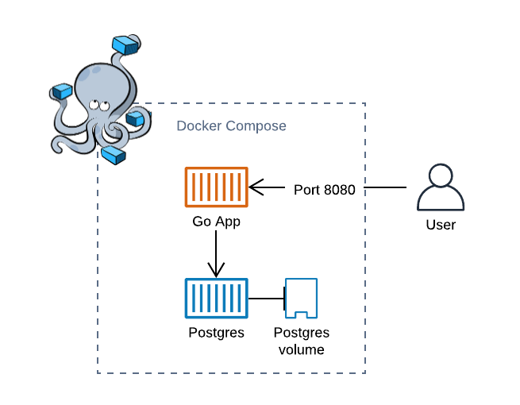

# Go Docker

This repository contains an example of a containerized Go application with a Postgres database using Docker and Docker Compose. The application uses best practices to optimize the Docker image

The application is a simple CRUD web application writen in Go that makes use of a Postgres database

## Dockerfile

- The Dockerfile uses *Multi-Stage* to build the application so just Docker is needed to build the application
- The layers of the Dockerfile are organized to optimize the image cache at build time
- The base image is a small alpine image with the executable for the application

### Hadolint

Hadolint is a smart Dockerfile linter that helps you build best practice Docker images. The linter parses the Dockerfile and perform rules on top of it to see if it complies with all the best practices.
You can find more information on the [Hadolint Repo](https://github.com/hadolint/hadolint)

## Local Environment

You can run the application in a local environment using Docker Compose, this runs the container of the application alongside a postgres container

To run the application locally:

```console
$ docker-compose build
```
```console
$ docker-compose up
```



## Getting Started

### Go application

To build the Go application image:

```console
$ docker build -t goapp .
```

### Postgres database

The database needs to be initialized with some tables for the application to work

```console
$ cd datastore
$ docker build -t goapp-postgres .
```
